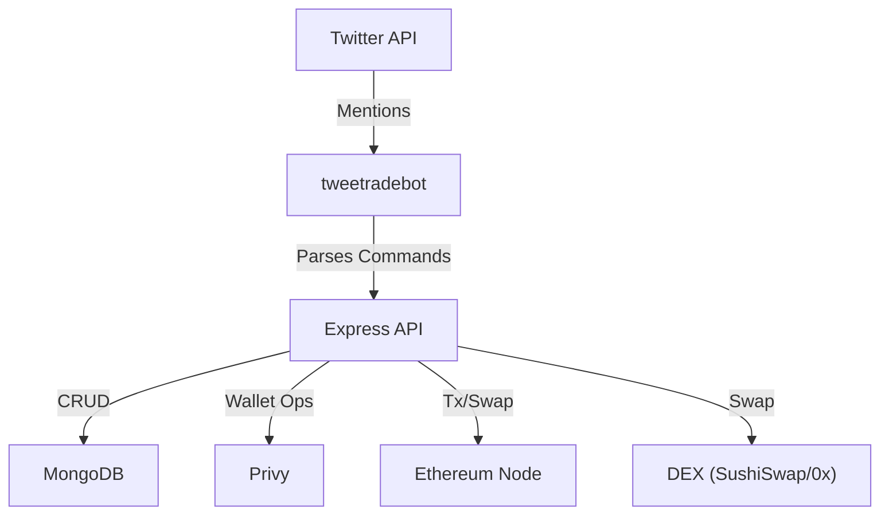

# tweetradebot

A Node.js-based Twitter bot that enables users to interact with Ethereum and DEX functionality directly from Twitter. Users can manage wallets, view transaction history, and perform swaps by tweeting at the bot.

---

## Features

- Listens to Twitter mentions and processes commands
- Creates and manages Ethereum wallets for users
- Executes Ethereum transactions (send, swap)
- Retrieves tweet and transaction history
- Integrates with Privy for secure wallet management
- Supports DEX swaps (e.g., METIS to USDT via SushiSwap)
- Robust error handling and logging

---

## Tech Stack

- Node.js
- Express
- MongoDB (via Mongoose)
- Twitter API (twitter-api-v2)
- Privy (wallet management)
- Ethereum (ethers.js, viem)
- SushiSwap SDK, 0x API (DEX swaps)
- Alith (AI command parsing)
- Winston (logging)

---

## Quick Start

### Prerequisites

- Node.js v16 or higher
- MongoDB instance (local or cloud)
- Twitter Developer Account (API credentials)
- Privy account (API credentials)
- Ethereum node access (e.g., Infura, Alchemy)
- SushiSwap/0x API key (for DEX swaps)

### Installation

```bash
git clone <repository-url>
cd tweetradebot
npm install
```

### Environment Setup

Copy `.env.example` to `.env` and fill in your credentials:

```bash
cp .env.example .env
# Edit .env with your API keys and settings
```

### Running the Server

Development mode:
```bash
npm run dev
```

Production mode:
```bash
npm start
```

---

## API Documentation

All endpoints require the `X-Twitter-User-Id` header.

| Method | Path                | Description                                 | Params/Body         | Response Example                |
|--------|---------------------|---------------------------------------------|---------------------|---------------------------------|
| GET    | `/api/wallet`       | Get or create wallet for Twitter user       | Header: X-Twitter-User-Id | `{ "address": "0x..." }`        |
| POST   | `/api/wallet/export`| Export (decrypt) user's private key         | Header: X-Twitter-User-Id | `{ "privateKey": "..." }`       |
| GET    | `/api/history`      | Get tweet/transaction history (paginated)   | Header: X-Twitter-User-Id, Query: `page`, `limit` | `{ "history": [...], "total": 10, "page": 1, "limit": 20 }` |

**Example:**
```bash
curl -H "X-Twitter-User-Id: 123456" http://localhost:3000/api/wallet
```

---

## Architecture Overview

- **src/index.js**: Main entry, starts the bot and schedules Twitter checks.
- **src/server.js**: Express API server, exposes wallet/history endpoints.
- **src/handlers/tweetHandler.js**: Processes incoming tweets, parses commands, triggers actions.
- **src/services/**: Business logic for Twitter, Ethereum, DEX, Privy, etc.
- **src/utils/logger.js**: Logging setup.



---

## Contributing

Currently, external contributions are not expected.  
If you find a bug or have a feature request, please open an issue.

---

## License

MIT — see [LICENSE](./LICENSE)

---

## Contact / Community

For help or questions, open an issue or email lazydevpro@gmail.com.

---

## Security

If you discover a security vulnerability, please see [SECURITY.md](./SECURITY.md) for responsible disclosure instructions. 