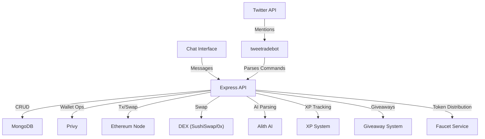

# tweetradebot

A Node.js-based Twitter bot that enables users to interact with Ethereum and DEX functionality directly from Twitter. Users can manage wallets, view transaction history, perform swaps, participate in giveaways, and earn XP through various activities.

---

## Features

- **Twitter Integration**: Listens to Twitter mentions and processes commands
- **Wallet Management**: Creates and manages Ethereum wallets for users via Privy
- **DeFi Operations**: Executes Ethereum transactions (send, swap) and DEX swaps
- **XP & Gamification**: Comprehensive XP system with levels, achievements, and leaderboards
- **Giveaways**: Create and participate in token giveaways with time-based rules
- **Faucet System**: Automated token distribution with cooldown management
- **Chat Interface**: Direct chat functionality without posting to Twitter
- **Transaction Tracking**: Complete swap transaction history and analytics
- **AI-Powered**: Natural language command parsing via Alith AI
- **Robust Logging**: Comprehensive logging and error handling

---

## Tech Stack

- **Backend**: Node.js, Express
- **Database**: MongoDB (via Mongoose)
- **Social**: Twitter API (twitter-api-v2)
- **Blockchain**: Ethereum (ethers.js, viem), Privy (wallet management)
- **DeFi**: SushiSwap SDK, 0x API (DEX swaps)
- **AI**: Alith (natural language command parsing)
- **Utilities**: Winston (logging), CORS, OAuth 1.0a

---

## Quick Start

### Prerequisites

- Node.js v16 or higher
- MongoDB instance (local or cloud)
- Twitter Developer Account (API credentials)
- Privy account (API credentials)
- Ethereum node access (e.g., Infura, Alchemy)
- SushiSwap/0x API key (for DEX swaps)
- Faucet contract address and private key (for drip functionality)

### Installation

```bash
git clone <repository-url>
cd tweetradebot
npm install
```

### Environment Setup

Copy `.env.example` to `.env` and fill in your credentials:

```bash
cp .env.example .env
# Edit .env with your API keys and settings
```

### Running the Server

Development mode:
```bash
npm run dev
```

Production mode:
```bash
npm start
```

---

## API Documentation

All endpoints require the `X-Twitter-User-Id` header.

### Core Wallet & History Endpoints

| Method | Path                | Description                                 | Params/Body         | Response Example                |
|--------|---------------------|---------------------------------------------|---------------------|---------------------------------|
| GET    | `/api/wallet`       | Get or create wallet for Twitter user       | Header: X-Twitter-User-Id | `{ "address": "0x..." }`        |
| POST   | `/api/wallet/export`| Export (decrypt) user's private key         | Header: X-Twitter-User-Id | `{ "privateKey": "..." }`       |
| GET    | `/api/history`      | Get tweet/transaction history (paginated)   | Header: X-Twitter-User-Id, Query: `page`, `limit` | `{ "history": [...], "total": 10, "page": 1, "limit": 20 }` |
| GET    | `/api/history/chat` | Get chat history (paginated)                | Header: X-Twitter-User-Id, Query: `page`, `limit` | `{ "history": [...], "total": 5, "page": 1, "limit": 20 }` |

### Chat & AI Endpoints

| Method | Path                | Description                                 | Params/Body         | Response Example                |
|--------|---------------------|---------------------------------------------|---------------------|---------------------------------|
| POST   | `/api/chat`         | Process chat message with AI parsing        | Body: `{ "message": "...", "twitterUserId": "..." }` | `{ "status": "success", "reply": "...", "action": "..." }` |

### XP & Gamification Endpoints

| Method | Path                | Description                                 | Params/Body         | Response Example                |
|--------|---------------------|---------------------------------------------|---------------------|---------------------------------|
| GET    | `/api/leaderboard`  | Get global XP leaderboard                   | Query: `page`, `limit` | `{ "leaderboard": [...], "total": 100, "page": 1, "limit": 20 }` |
| GET    | `/api/user/xp`      | Get current user's XP and level             | Header: X-Twitter-User-Id | `{ "totalXP": 5000, "level": "Silver", "rank": 15 }` |
| GET    | `/api/user/rank`    | Get current user's rank                     | Header: X-Twitter-User-Id | `{ "rank": 15, "totalUsers": 100 }` |
| GET    | `/api/user/:username/xp` | Get specific user's XP info             | Path: username     | `{ "totalXP": 3000, "level": "Bronze", "rank": 25 }` |
| GET    | `/api/user/:username/rank` | Get specific user's rank               | Path: username     | `{ "rank": 25, "totalUsers": 100 }` |
| GET    | `/api/xp/stats`     | Get global XP statistics                   | None                | `{ "totalUsers": 100, "totalXP": 500000, "averageXP": 5000 }` |

### Swap Transaction Endpoints

| Method | Path                | Description                                 | Params/Body         | Response Example                |
|--------|---------------------|---------------------------------------------|---------------------|---------------------------------|
| GET    | `/api/swap/transactions` | Get user's swap transactions         | Header: X-Twitter-User-Id, Query: `page`, `limit` | `{ "transactions": [...], "total": 5, "page": 1, "limit": 20 }` |
| GET    | `/api/swap/transactions/all` | Get all swap transactions (admin)    | Query: `page`, `limit`, `status` | `{ "transactions": [...], "total": 100, "page": 1, "limit": 50 }` |
| GET    | `/api/swap/transactions/:txHash` | Get specific swap transaction    | Path: txHash       | `{ "txHash": "...", "status": "completed", ... }` |
| GET    | `/api/swap/statistics` | Get swap statistics and analytics     | None                | `{ "totalSwaps": 100, "totalVolume": "1000", "successRate": 0.95 }` |
| GET    | `/api/swap/search`  | Search swap transactions               | Query: `query`, `page`, `limit` | `{ "results": [...], "total": 10, "page": 1, "limit": 20 }` |
| POST   | `/api/swap/transactions` | Create new swap transaction record | Body: swap data    | `{ "status": "success", "transaction": {...} }` |
| PUT    | `/api/swap/transactions/:txHash` | Update swap transaction        | Path: txHash, Body: update data | `{ "status": "success", "transaction": {...} }` |
| DELETE | `/api/swap/transactions/:txHash` | Delete swap transaction        | Path: txHash       | `{ "status": "success", "message": "Deleted" }` |

**Example:**
```bash
curl -H "X-Twitter-User-Id: 123456" http://localhost:3001/api/wallet
```

---

## Command Reference

### Twitter Commands
- `balance` - Check wallet balance
- `send <amount> <token> to @username` - Send tokens to another user
- `swap <amount> <from_token> for <to_token>` - Execute DEX swap
- `create wallet` - Create new wallet
- `drip` - Request tokens from faucet (24h cooldown)
- `giveaway <amount> <token> <winners> <duration> <tweet_url>` - Create giveaway
- `join <tweet_url>` - Participate in giveaway

### Chat Commands
Same functionality as Twitter commands, but processed via `/api/chat` endpoint without posting to Twitter.

---

## XP System

Users earn XP through various activities:
- **Swap Operations**: 10,000 XP per swap amount
- **Token Transfers**: 1,000 XP per transfer amount  
- **Balance Checks**: 100 XP (once per day)
- **Wallet Creation**: 100 XP (one-time bonus)
- **Faucet Usage**: 100 XP per drip
- **Giveaway Creation**: 100 XP per giveaway
- **Giveaway Participation**: 50 XP per entry
- **Daily Login**: 100 XP (once per day)

### Levels
- **Bronze**: 0 - 5,000 XP
- **Silver**: 5,001 - 15,000 XP
- **Gold**: 15,001 - 50,000 XP
- **Platinum**: 50,001 - 100,000 XP
- **Diamond**: 100,001+ XP

---

## Architecture Overview

- **src/index.js**: Main entry point, starts the bot, schedules Twitter checks and giveaway processing
- **src/server.js**: Express API server with comprehensive endpoints for wallet, history, chat, XP, and swap management
- **src/handlers/tweetHandler.js**: Processes incoming tweets, parses commands, triggers actions
- **src/handlers/chatHandler.js**: Handles direct chat messages with AI-powered command parsing
- **src/services/**: Business logic modules:
  - **privyUserService.js**: Core wallet and user management
  - **xpService.js**: XP system, levels, leaderboards, and achievements
  - **giveawayService.js**: Giveaway creation, participation, and management
  - **faucetService.js**: Automated token distribution with cooldown tracking
  - **swapTransactionService.js**: Complete swap transaction tracking and analytics
  - **twitterService.js**: Twitter API integration
  - **alithService.js**: AI command parsing and natural language understanding
  - **dexService.js**: DEX swap execution
  - **ethereumService.js**: Ethereum blockchain interactions
- **src/utils/**: Utility modules for logging and address validation



---

## Contributing

Currently, external contributions are not expected.  
If you find a bug or have a feature request, please open an issue.

---

## License

MIT — see [LICENSE](./LICENSE)

---

## Contact / Community

For help or questions, open an issue or email lazydevpro@gmail.com.

---

## Security

If you discover a security vulnerability, please see [SECURITY.md](./SECURITY.md) for responsible disclosure instructions. 